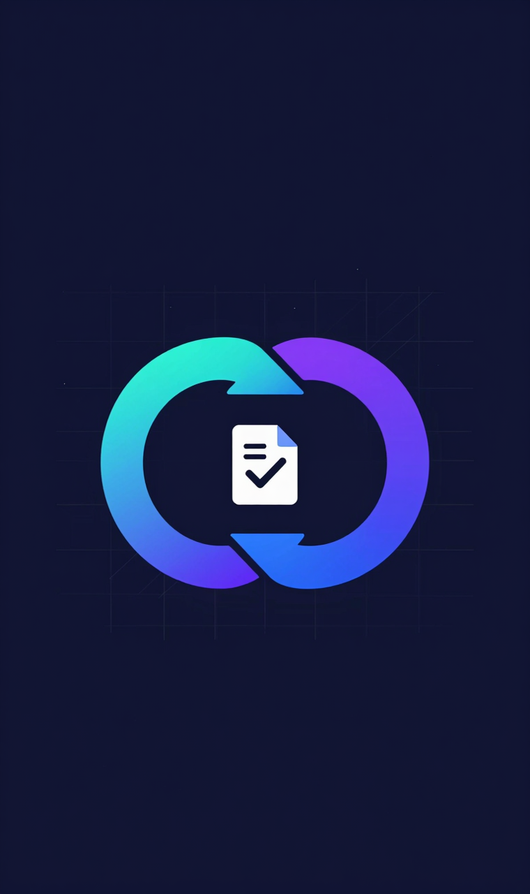

<div align="center">

# 🔄 SDDL — Spec-Driven Development Loop

**以结构化 Spec 为单一事实来源的双 Loop 开发方法论**



[](LICENSE)
[](https://www.python.org/)
[](https://pyyaml.org/)
[](https://github.com/xt-mahh/sddl)

*先定义清楚做什么，再动手写代码。*

</div>

---

## 目录

- [为什么需要 SDDL？](#为什么需要-sddl)
- [双 Loop 架构](#双-loop-架构)
- [核心特性](#核心特性)
- [快速开始](#快速开始)
- [与 Hermes Agent Skill 集成](#与-hermes-agent-skill-集成)
- [项目结构](#项目结构)
- [方法论核心](#方法论核心简述)
- [证据基础](#证据基础)
- [适用门槛](#适用门槛)
- [License](#license)

## 为什么需要 SDDL？

AI 编程时代的三个核心痛点：

| 痛点 | 本质 | 后果 |
|------|------|------|
| **上下文漂移** | 对话越长，AI 越易遗忘早期约定 | 第 N 轮推翻第 3 轮的接口约定 |
| **多 artifact 不同步** | 代码改了，测试/文档没跟上 | "文档谎言"被 AI 时代放大 |
| **验收主观化** | "感觉对了"代替"符合规格" | 无法审计、无法复现、无法交接 |

对话式编程的问题在于：**上下文窗口有限，对话越长越容易漂移**。你跟 AI 聊了 50 轮，第 51 轮它已经忘了第 3 轮约定的接口格式。

**SDDL 的答案**：用稳定可全文加载的 Spec 做单一事实来源，用双 Loop 闭环保证质量和可审计性。

## 双 Loop 架构

```
┌─────────────────────────────────────────────────────────────────────┐
│                   形成 Loop（回答"做什么"）                            │
│  需求 ──▶ 访谈 ──▶ Spec草稿 ──▶ SQC质量检查 ──▶ 决策点确认 ──▶ 冻结   │
└───────────────────────────────────────────────┬─────────────────────┘
                                                ▼
┌─────────────────────────────────────────────────────────────────────┐
│                   派生 Loop（回答"怎么做对"）                           │
│  冻结 Spec ──▶ tests/code/docs ──▶ C1-C4一致性检查 ──▶ 收敛           │
│        ▲                                        │                    │
│        └──── spec缺陷 ──▶ 解冻回形成Loop ──▶ 重新冻结 ──┘             │
└─────────────────────────────────────────────────────────────────────┘
```

- **形成 Loop**：保证"做对的事"——需求 → 访谈 → Spec 草稿（含决策点标记）→ SQC 质量检查 → 决策点人工确认 → 冻结
- **派生 Loop**：保证"把事做对"——冻结 Spec → tests/code/docs 三件套同步派生 → C1-C4 分层一致性检查 → 收敛
- **回写通道**：实现中发现的 spec 缺陷 → 解冻 → 回形成 Loop 修订 → 重新冻结（不绕过质量门禁）

## 核心特性

| 特性 | 说明 |
|------|------|
| **决策点机制** | 模糊处 AI 不静默决定，标记为决策点，用户用 clarify 逐项确认（含自定义输入） |
| **SQC 质量检查** | Spec 自身的质量门禁：schema 合法/引用完整/可断言性/行为覆盖/矛盾检测 |
| **C1-C4 分层检查** | artifacts 与 spec 的一致性：验收覆盖（含变异测试反推）/接口对比/测试执行/文档符号表 |
| **目录即状态** | 进度编码在目录结构里，中断恢复免费（配合 git commit 作为 checkpoint） |
| **预算控制** | 形成/实现/修订三预算，量化降级路径，修订激励不惩罚诚实 |
| **可审计** | 每个决策点确认记录、每次修订 CHANGELOG、每次检查报告 JSON，全程可追溯 |

## 快速开始

```bash
# 1. 克隆
git clone https://github.com/xt-mahh/sddl.git
cd sddl

# 2. 运行检查器（需要 PyYAML）
pip install pyyaml

# 3. SQC 检查（spec 冻结前）
python3 scripts/check_sqc.py sddl/specs/<domain>/spec.yaml --verbose

# 4. C1-C4 一致性检查（verify 时）
python3 scripts/check_c1_c4.py . --verbose

# 5. 状态恢复（中断后）
python3 scripts/sddl_status.py .
```

示例输出：

```bash
$ python3 scripts/check_sqc.py sddl/specs/accounting/spec.yaml --verbose
SQC [0.1.1]: ✅ PASS
  ✅ def-schema
  ✅ def-refs
  ✅ def-assertability
  ✅ def-dp
  ✅ sem-coverage
  ✅ sem-contradiction
  ✅ sem-testability

$ python3 scripts/check_c1_c4.py . --verbose
C1-C4 [accounting v0.1.1]: ✅ CONVERGED
  ✅ c1_def
  ✅ c2_def
  ✅ c3
  ✅ c4b_def
  soft: c1_sem=1.0 c2_sem=1.0 c4a=1.0 c4b_sem=1.0 must=1.0
```

完整示例见 [`examples/accounting/`](examples/accounting/)——一个从"帮我做个记账小程序"到收敛交付的完整项目（含 spec、决策点确认、SQC/C1-C4 报告、变更记录）。

## 与 Hermes Agent Skill 集成

本项目的 Skill 化版本位于 [`hermes-skill/`](hermes-skill/)：

```
hermes-skill/sddl/
├── SKILL.md                     主入口 + 8 个分阶段命令
├── references/ (5个)            渐进披露手册
├── scripts/ (3个)               ← 与根目录 scripts/ 相同
└── templates/ (2个)             spec 骨架 + 决策点摘要
```

安装：将 `hermes-skill/sddl/` 复制到 `~/.hermes/skills/software-development/`，即可在 Hermes Agent 中使用 `/sddl:init` `/sddl:interview` `/sddl:spec` `/sddl:confirm` `/sddl:freeze` `/sddl:derive` `/sddl:verify` `/sddl:archive` 分阶段命令。

## 项目结构

```
sddl/
├── scripts/                     检查器脚本（可直接运行）
│   ├── check_sqc.py             SQC 检查（形成 Loop 门禁）
│   ├── check_c1_c4.py           C1-C4 一致性检查（派生 Loop 门禁）
│   └── sddl_status.py           状态恢复（目录即状态）
├── references/                  方法论手册（渐进披露）
│   ├── formation-loop.md        形成 Loop 详细流程
│   ├── derivation-loop.md       派生 Loop 详细流程
│   ├── spec-schema.md           Spec 五层结构
│   ├── sqc-checklist.md         SQC 检查清单
│   └── checker-matrix.md        C1-C4 检查矩阵
├── templates/                   spec 骨架 + 决策点摘要模板
├── examples/                    完整示例项目
│   └── accounting/              记账/对账服务（从零到收敛）
├── hermes-skill/                Hermes Agent Skill 版
├── docs/                        最终方案（v1.1）
└── LICENSE
```

## 方法论核心（简述）

### Spec 五层结构

| 层 | 内容 | 机器可消费性 |
|----|------|------------|
| L1 接口契约 | 函数签名、参数、返回、错误类型 | 完全（类型检查/AST） |
| L2 数据模型 | JSON Schema | 完全（schema 验证） |
| L3 行为描述 | GWT 场景 + 优先级 | 半（结构可解析） |
| L4 边界条件 | 极端情况 + 优先级 | 半 |
| L5 质量约束 | 性能/安全/可观测 | 弱（性能类标 env） |

### 收敛判定

```
硬门禁：C1-def ∧ C2-def ∧ C3 ∧ C4b-def 全过（确定性）
软共识：c1_sem≥0.95 ∧ c2_sem≥0.95 ∧ c4a≥0.90 ∧ c4b_sem≥0.90（Checklist 计票）
且 must 覆盖 = 100% 且无 blocker violation → 收敛
```

### 检查矩阵

```
          Tests        Code        Docs
         ┌──────┐    ┌──────┐    ┌──────┐
 Spec    │ C1   │    │ C2   │    │ C4a  │
         ├──────┤    ├──────┤    ├──────┤
 Tests   │      │    │ C3   │    │  —   │
         ├──────┤    ├──────┤    ├──────┤
 Code    │      │    │      │    │ C4b  │
         └──────┘    └──────┘    └──────┘
```

## 证据基础

SDDL 的设计经过文献验证（arXiv 论文）与三轮评审循环打磨：

- **Self-Refine** (arXiv 2303.17651) — self-refine loop 范式源头
- **Pride and Prejudice** (arXiv 2402.11436) — LLM 自反馈放大自偏置 → 异模型检查
- **TICKing All the Boxes** (arXiv 2410.07061) — checklist 生成改善 LLM 评估
- **Calibration Collapse Under Sycophancy** (arXiv 2026-04) — 绝对分数不可信 → 客观计票
- **LLMorpheus** (arXiv 2404.09954) — LLM 变异测试 → 验收反推验证
- **OpenSpec** (Fission-AI) — specs/+changes/+archive 变更管理实践

完整证据链见 [`docs/SDDL-方案-v1.1.md`](docs/SDDL-方案-v1.1.md) 附录 A。

## 适用门槛

| 模式 | 适用 | 成本 |
|------|------|------|
| 完整 SDDL | 接口≥8 且 must 验收≥10 且多 artifact 同步 | 高 |
| 标准 SDDL | 接口 5-8 | 中 |
| 轻量 SDD | 接口<5 但多 artifact | 低 |
| 纯 TDD | 其余 | 最低 |

**不适用**：一次性脚本、原型/POC、探索性研究代码。

## License

MIT License — 见 [LICENSE](LICENSE)

## 致谢

- 方法论经过 3 轮评审循环（35 个问题关闭）+ 2 轮文献验证（arXiv 17 篇 + OpenSpec 实践）
- Hermes Agent Skill 化版本经过 8 个分阶段命令 + 7 个测试场景验证
